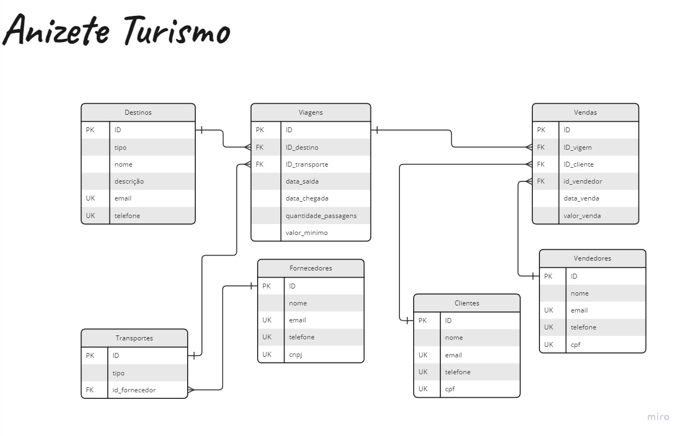

# Projeto Banco de Dados
✨ Projeto da diciplina de Banco de dados, ministrada pelo [Prof. Dr. FRANCISCO ISIDRO MASSETTO](https://www.ufabc.edu.br/ensino/docentes/francisco-isidro-massetto)

O projeto da disciplina de Banco de Dados da Universidade Federal do ABC para a empresa de viagens "Anizete Turismo" abrange diversos aspectos cruciais para o funcionamento eficiente do sistema. A seguir, são detalhadas as etapas principais do desenvolvimento do sistema de banco de dados para atender às necessidades levantadas na entrevista.

### Pontos principais levantados na entrevista:
- Definir local da viagem (Ponto turístico, parque aquático, parque de diversões)
    - Antes de iniciar qualquer venda, a empresa precisa definir os destinos para onde oferecerá viagens. Estes destinos podem incluir pontos turísticos, parques aquáticos e parques de diversões. Cada destino deve ser cadastrado no sistema com informações relevantes, como nome, tipo (ponto turístico, parque aquático, parque de diversões) e qualquer outra informação específica.
- Definir quantidade de passagens a serem vendidas 
    - Para cada viagem planejada, é necessário definir a quantidade total de passagens disponíveis para venda. Isso pode depender de fatores como a capacidade do meio de transporte escolhido e a capacidade de acomodação no destino. Essa informação será crucial para a gestão de vendas e para evitar o overbooking.
- A partir do número de passagens definir quais os meios de transporte (Ônibus, Micro-ônibus, Van) (Dados das empresas de transporte)
    - Com a quantidade de passagens definida, a empresa deve determinar os meios de transporte necessários para atender à demanda. Isso pode incluir ônibus, micro-ônibus ou vans. A escolha do meio de transporte pode depender da distância até o destino, do número de passageiros e do conforto desejado. Essa decisão influenciará diretamente os custos operacionais e, consequentemente, o preço das passagens.
- Vender as passagens para os clientes (Dados de venda e cliente) (Diversos vendedores) (Valor minimo para venda)
    - O processo de venda de passagens envolve interação com os clientes. Isso pode ser feito presencialmente em um balcão de atendimento, por telefone ou, mais comumente nos dias de hoje, online através de um site ou aplicativo. Durante a venda, é importante coletar informações dos clientes, como nome, contato e, se possível, informações adicionais para personalizar a experiência, como preferências alimentares ou necessidades especiais.
    Os dados da venda devem ser registrados, incluindo a data da transação, o cliente envolvido, o destino escolhido, a quantidade de passagens adquiridas e o valor total da transação. Além disso, a empresa pode implementar um sistema de reserva para garantir a disponibilidade de passagens para os clientes durante um período específico antes da viagem.
    Os clientes devem receber confirmações de compra, itinerários detalhados e informações importantes sobre a viagem. Manter uma comunicação clara e eficiente é essencial para garantir uma boa experiência do cliente.

### Tabelas e Relações
- Destinos
  > id (chave primária)

	> tipo_destino (Ponto turístico, Parque aquático, Parque de diversões)
	
	>nome

	>descricao

	>email (chave única)

	>telefone (chave única)

- Transportes
	>id (chave primária)
	
	>tipo (Ônibus, Micro-ônibus, Van)
	
	>id_fornecedor (chave estrangeira referenciando id da tabela Fornecedores)

- Fornecedores

	>id (chave primária)

	>nome

	>email (chave única)

	>telefone (cheve única)

	>cnpj (chave única)

- Viagens

	>id (chave primária)

	>id_destino (chave estrangeira referenciando id da tabela Destinos)

	>id_transporte (chave estrangeira referenciando id da tabela Transportes)

	>data_saida

	>data_chegada

	>quantidade_passagens

	>valor_minimo

- Clientes
	
	>id (chave primária)
	
	>nome
	
	>email (chave única)
	
	>telefone (chave única)
	
	>cpf (chave única)

- Vendas

	> id (chave primária)

	>id_viagem (chave estrangeira referenciando id da tabela Viagens)

	>id_cliente (chave estrangeira referenciando id da tabela Clientes)

	>id_vendedor (chave estrangeira referenciando id da tabela Vendedores)

	>data_venda

	>valor_venda

- Vendedores

	>id (chave primária)	

	>nome	

	>email (chave única)	

	>telefone (chave única)	

	>cpf (chave única)

### Modelo Entidade Relacionamento
(https://miro.com/welcomeonboard/YlRKWEFZRzBHb3IwZ2FRaFJGdVJ4WnZ3WEZkaldVOTZzbkVnY3JITDNabEFaZXFtMzRRMks0V1ExWkt0WWNkUnwzNDU4NzY0NTQ5OTI4NDc2MzE1fDI=?share_link_id=985976876113)